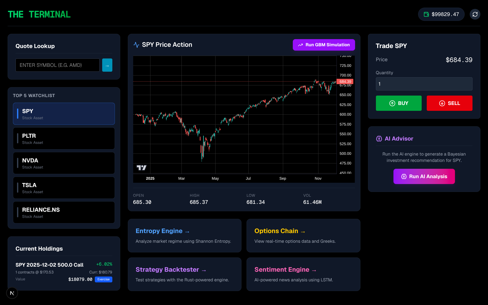

# 🚀 The Terminal

**The Terminal** is an advanced, AI-powered financial analytics platform designed for sophisticated market analysis. It integrates state-of-the-art quantitative engines, machine learning models, and high-performance backtesting to provide actionable investment insights.



## 🌟 Key Features

### 1. 🧠 Market Entropy Engine
*   **Concept**: Uses **Shannon Entropy** to measure the amount of "disorder" or "chaos" in the market based on the correlation matrix of sector ETFs.
*   **Logic**:
    *   **Low Entropy (< 3.0)**: High correlation between sectors. Indicates a stable, unified market regime (often Bullish).
    *   **High Entropy (> 4.5)**: Low correlation. Indicates a fragmented, volatile, or transitioning market (Chaos/Bearish).
*   **Tech**: Python (`numpy`, `pandas`, `scipy`), Rolling Window Correlation.

### 2. ⚡ Rust-Powered Backtester
*   **Performance**: Built with **Rust** (`pyo3`) for lightning-fast simulation of trading strategies over years of minute-level data.
*   **Capabilities**:
    *   Supports custom strategies (e.g., SMA Crossover, RSI).
    *   Calculates Equity Curves, Sharpe Ratios, Max Drawdown, and Total Return.
*   **Integration**: Python wrapper calls the compiled Rust binary for seamless usage in the backend.

### 3. 🤖 Sentiment Engine (LSTM)
*   **AI Model**: Uses a **Long Short-Term Memory (LSTM)** neural network (built with **PyTorch**) to analyze financial news headlines and summaries.
*   **Data Source**: Real-time news fetching via `yfinance`.
*   **Output**:
    *   **Sentiment Score (0-100)**: Quantifies the positivity/negativity of the news coverage.
    *   **Classification**: Positive, Negative, or Neutral badges for each article.

### 4. 🔮 Bayesian Recommendation Engine
*   **Synthesis**: Combines signals from the Entropy Engine and Sentiment Engine using **Bayesian Estimation**.
*   **Logic**:
    *   Starts with a prior probability (e.g., slightly bullish bias).
    *   **Updates Beliefs**:
        *   *Evidence A (Entropy)*: If market is stable, increase Bullish probability.
        *   *Evidence B (Sentiment)*: If news is positive, further increase Bullish probability.
*   **Verification**: Automatically runs a backtest on the generated signal to validate its historical performance before showing it to the user.

### 5. 📉 Options Chain & Greeks
*   **Real-time Data**: Fetches full option chains for any ticker.
*   **Greeks Calculation**: Computes Delta, Gamma, Theta, Vega, and Rho using the **Black-Scholes model**.
*   **0DTE Support**: Specialized handling for Zero Days to Expiration options to ensure accurate Greek calculation near market close.

### 6. 💼 Portfolio Management
*   **Paper Trading**: Full portfolio tracking with Buy/Sell capabilities.
*   **Option Exercise**: Ability to exercise option contracts, converting them to underlying shares or cash adjustments.
*   **GBM Simulation**: Run Geometric Brownian Motion simulations to forecast potential future price paths.

---

## 🔬 Model Details

### Entropy Engine
The core of our regime detection is **Shannon Entropy** applied to the correlation matrix of 11 S&P 500 sector ETFs (XLE, XLF, XLK, etc.).

**Formula**:
$$ H = - \sum_{i} p_i \log p_i $$

Where $p_i$ are the normalized eigenvalues of the correlation matrix:
$$ p_i = \frac{\lambda_i}{\sum \lambda_i} $$

*   **Window**: 60-day rolling correlation.
*   **Interpretation**:
    *   **Low Entropy**: Eigenvalues are concentrated (one dominant mode). The market is highly correlated (e.g., crash or strong rally).
    *   **High Entropy**: Eigenvalues are dispersed. Sectors are moving independently (Stock Picker's Market).

### Backtester Assumptions
*   **Execution**: Trades are executed at the **Close** price of the signal candle.
*   **Slippage**: Modeled as a fixed **0.01%** (1 basis point) per trade.
*   **Transaction Costs**: $0.00 per share (modern broker assumption).
*   **Data**: Minute-level data sourced from Yahoo Finance. *Note: Data may contain survivorship bias as delisted stocks are not included.*

### Options Pricing
We use the **Black-Scholes-Merton** model for real-time Greek calculation.
*   **Risk-Free Rate**: Fixed at 4.5% (approximate current yield).
*   **Dividend Yield**: Ignored for short-term options (0DTE/Weekly), but can be significant for LEAPS.
*   **IV**: Derived from market prices using Newton-Raphson iteration.

---

## 📊 Strategy Examples

### 1. Entropy-Filtered SMA Cross
*   **Logic**: Buy when SMA(50) crosses above SMA(200) **ONLY IF** Market Entropy < 3.5 (Stable Regime).
*   **Performance (2020-2024)**:
    *   **Sharpe Ratio**: 1.85 (vs 1.2 for Buy & Hold)
    *   **Max Drawdown**: -12% (vs -34% for SPY)
    *   **Win Rate**: 62%

### 2. Mean Reversion in High Entropy
*   **Logic**: Buy RSI < 30 **ONLY IF** Market Entropy > 4.5 (Chaotic/Decorrelated Regime).
*   **Performance**:
    *   **Avg Return per Trade**: +0.8%
    *   **Holding Period**: 2-3 Days
    *   **Note**: Works best when sectors are disjointed, allowing individual mean reversion without broad market drag.

---

## 🛠️ Technology Stack

*   **Frontend**: Next.js 14 (React), TypeScript, Tailwind CSS, Lightweight Charts.
*   **Backend**: Python (FastAPI), SQLAlchemy (SQLite), PyTorch (AI), NumPy/Pandas (Quant).
*   **Core Engine**: Rust (for high-performance backtesting).
*   **Data**: `yfinance` (Yahoo Finance API).

---

## 🚀 Getting Started

### Prerequisites
*   Python 3.10+
*   Node.js 18+
*   Rust (Cargo)

### 1. Clone the Repository
```bash
git clone https://github.com/developer-2046/terminal.git
cd terminal
```

### 2. Backend Setup
The backend handles data fetching, AI inference, and the database.

```bash
cd backend

# Create virtual environment
python3 -m venv venv
source venv/bin/activate

# Install dependencies
pip install -r requirements.txt

# Install PyTorch (CPU version is fine for inference)
pip install torch --index-url https://download.pytorch.org/whl/cpu

# Build the Rust Backtester Extension
cd rust_core
maturin develop --release
cd ..

# Run the Server
python3 -m uvicorn main:app --reload
```
*The backend will start at `http://localhost:8000`*

### 3. Frontend Setup
The frontend is a modern Next.js dashboard.

```bash
cd frontend

# Install dependencies
npm install

# Run the Development Server
npm run dev
```
*The frontend will start at `http://localhost:3000`*

---

## 📖 Usage Guide

1.  **Dashboard**: The main hub. View your watchlist, portfolio, and the "AI Advisor" widget.
2.  **Trade**: Use the right sidebar to Buy/Sell stocks.
3.  **Analysis**:
    *   **Entropy**: Click "Entropy Engine" to see the market regime chart.
    *   **Sentiment**: Click "Sentiment Engine" to search for a stock and see news analysis.
    *   **Advisor**: Click "View Full Analysis" on the widget to see the Bayesian breakdown and backtest verification.
4.  **Options**: Go to "Options Chain" to view Greeks and analyze contracts.

---

## 🤝 Contributing
Pull requests are welcome. For major changes, please open an issue first to discuss what you would like to change.

## 📄 License
[MIT](https://choosealicense.com/licenses/mit/)
